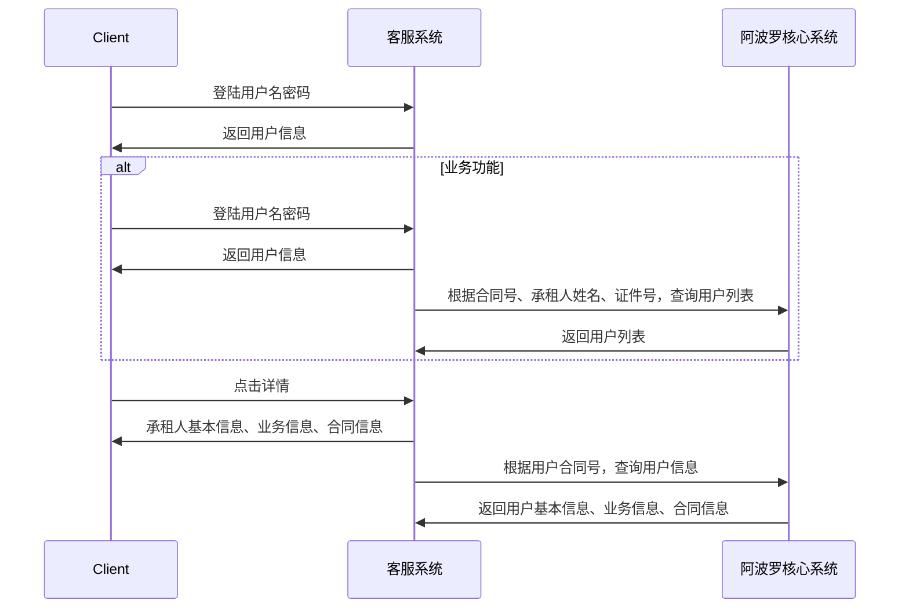

#####依赖服务
核心系统的查询接口

#####基础功能
1.客服系统的用户管理、角色管理、权限管理、部门管理、菜单管理、修改密码等功能。
2.业务相关的综合查询、快递查询、话务创建功能、话务小结、工单创建、查询、分配、处理、报表等功能

######客服系统主要时序

t_user（用户表）

| 列名      | 含义     | 类型              | 说明     | 其他   |
| --------- | -------- | ----------------- | -------- | ------ |
| id        | 用户主键 | bigint            | NOT NULL | ID唯一 |
| username  | 用户名称 | character varying | NULLABLE |        |
| password  | 用户密码 | character varying | NULLABLE |        |
| gender    | 性别     | character varying | NULLABLE |        |
| birthday  | 生日     | date              | NULLABLE |        |
| remark    | 备注     | character varying | NULLABLE |        |
| station   | 状态     | character varying | NULLABLE |        |
| telephone | 联系电话 | character varying | NULLABLE |        |
| dept_id   | 部门ID   | bigint            | NULLABLE |        |

t_role（角色表）

| 列名        | 含义       | 类型              | 说明     | 其他         |
| ----------- | ---------- | ----------------- | -------- | ------------ |
| id          | 角色主键ID | bigint            | NOT NULL | 主键必须唯一 |
| name        | 角色名称   | character varying | NULLABLE |              |
| keyword     | 角色关键字 | character varying | NULLABLE |              |
| description | 角色描述   | character varying | NULLABLE |              |

t_permission（权限表）

| 列名        | 含义       | 类型              | 说明     | 其他         |
| ----------- | ---------- | ----------------- | -------- | ------------ |
| id          | 权限主键ID | bigint            | NOT NULL | 主键必须唯一 |
| name        | 权限名称   | character varying | NULLABLE |              |
| keyword     | 权限关键字 | character varying | NULLABLE |              |
| description | 权限描述   | character varying | NULLABLE |              |

t_user_role（用户和角色关系表）

| 列名    | 含义   | 类型   | 说明     | 其他  |
| ------- | ------ | ------ | -------- | ----- |
| user_id | 用户ID | bigint | NOT NULL | 主键1 |
| role_id | 角色ID | bigint | NOT NULL | 主键2 |

t_role_permission（角色和权限关系表）

| 列名          | 含义   | 类型   | 说明     | 其他  |
| ------------- | ------ | ------ | -------- | ----- |
| role_id       | 角色ID | bigint | NOT NULL | 主键1 |
| permission_id | 权限ID | bigint | NOT NULL | 主键2 |

t_dept（部门表）

| 列名        | 含义           | 类型                        | 说明     | 其他                                 |
| ----------- | -------------- | --------------------------- | -------- | ------------------------------------ |
| dept_id     | 部门ID主键     | bigint                      | NOT NULL | ID唯一                               |
| parent_id   | 父节点ID       | bigint                      | NULLABLE |                                      |
| ancestors   | 所有上级部门ID | character varying           | NULLABLE |                                      |
| dept_name   | 部门名称       | character varying           | NULLABLE |                                      |
| order_num   | 排序优先级     | bigint                      | NULLABLE | 升序排序，值越小越靠前               |
| leader      | 负责人姓名     | character varying           | NULLABLE |                                      |
| phone       | 联系电话       | character varying           | NULLABLE |                                      |
| email       | 邮箱地址       | character varying           | NULLABLE |                                      |
| status      | 启用状态       | character                   | NULLABLE | 部门状态：启用/停用                  |
| del_flag    | 删除状态       | character                   | NULLABLE | 删除操作在后台改状态，不执行物理删除 |
| create_by   | 创建人         | character varying           | NULLABLE |                                      |
| create_time | 创建时间       | timestamp without time zone | NULLABLE |                                      |
| update_by   | 更新人         | character varying           | NULLABLE |                                      |
| update_time | 更新时间       | timestamp without time zone | NULLABLE |                                      |

t_user_dept（用户和部门关系表）

| 列名    | 含义   | 类型   | 说明     | 其他  |
| ------- | ------ | ------ | -------- | ----- |
| user_id | 用户ID | bigint | NOT NULL | 主键1 |
| dept_id | 部门ID | bigint | NOT NULL | 主键2 |

t_menu（菜单表）

| 列名         | 含义         | 类型                        | 说明     | 其他                   |
| ------------ | ------------ | --------------------------- | -------- | ---------------------- |
| id           | 菜单ID主键   | bigint                      | NOT NULL | ID唯一                 |
| name         | 菜单名称     | character varying           | NULLABLE |                        |
| linkurl      | 菜单路径地址 | character varying           | NULLABLE |                        |
| path         | 菜单路径缩写 | character varying           | NULLABLE |                        |
| priority     | 排序优先级   | bigint                      | NULLABLE | 升序排序，值越小越靠前 |
| icon         | 菜单图标名称 | character varying           | NULLABLE |                        |
| description  | 菜单描述     | character varying           | NULLABLE |                        |
| parentmenuid | 父级菜单ID   | bigint                      | NULLABLE |                        |
| visible      | 显示状态     | character                   | NULLABLE | 菜单状态：显示/隐藏    |
| perms        | 权限标识     | character                   | NULLABLE |                        |
| create_by    | 创建人       | character varying           | NULLABLE |                        |
| create_time  | 创建时间     | timestamp without time zone | NULLABLE |                        |
| update_by    | 更新人       | character varying           | NULLABLE |                        |
| update_time  | 更新时间     | timestamp without time zone | NULLABLE |                        |
| menu_type    | 菜单分类     | character                   | NULLABLE |                        |

t_role_menu（角色和菜单关系表）

| 列名    | 含义   | 类型   | 说明     | 其他  |
| ------- | ------ | ------ | -------- | ----- |
| role_id | 角色ID | bigint | NOT NULL | 主键1 |
| menu_id | 菜单ID | bigint | NOT NULL | 主键2 |

